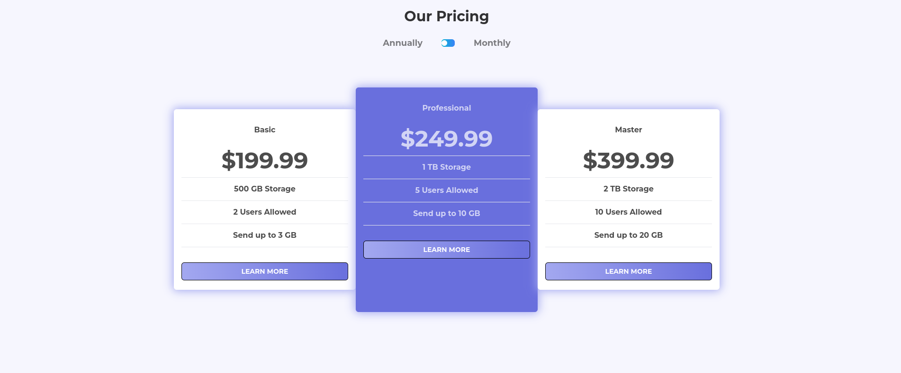
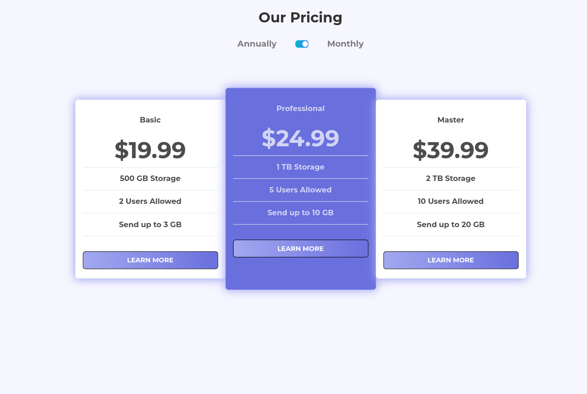

# Frontend Mentor - Pricing component with toggle solution

This is a solution to the [Pricing component with toggle challenge on Frontend Mentor](https://www.frontendmentor.io/challenges/pricing-component-with-toggle-8vPwRMIC). Frontend Mentor challenges help you improve your coding skills by building realistic projects.

### Screenshot

### Links

- Solution URL: [Add solution URL here](https://github.com/Genildocs/pricing-component-with-toggle-master)
- Live Site URL: [Add live site URL here](https://pricing-component-with-toggle-master-wine.vercel.app/)

## My process

### Built with

- Semantic HTML5 markup
- CSS custom properties
- Flexbox
- Mobile-first workflow
- [tailwindcss](https://tailwindcss.com/) - For styles

**Note: These are just examples. Delete this note and replace the list above with your own choices**

## Author

- Github -(https://github.com/Genildocs)
